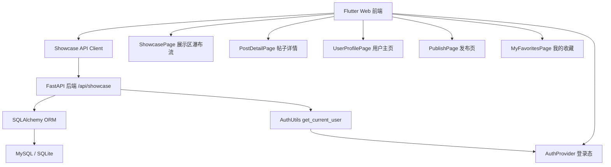
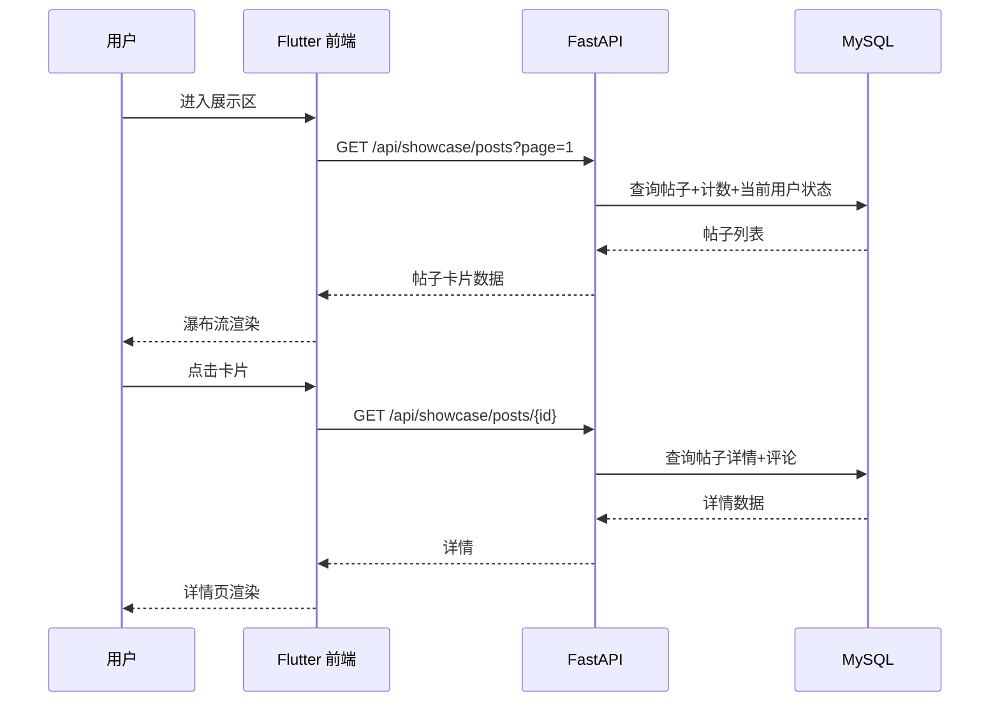
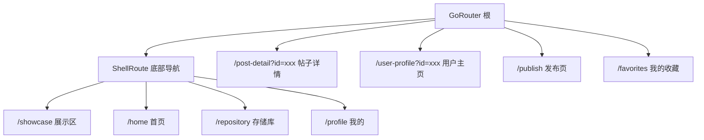

# 展示区（社区分享流）技术设计

Feature Name: community-showcase
Updated: 2026-08-14

## Description

在毕昇微光系统中新增"展示区"功能：已登录用户可将存储库中的盲文记录（或本地导入的文件）发布为公开帖子，并附上描述文字。展示区以瀑布流卡片呈现帖子摘要（描述开头 80 字），点击卡片进入详情页查看完整描述与数据内容；详情页展示发布者头像与 ID，点击可进入发布者个人主页。帖子支持点赞、收藏、评论，用户可管理自己的帖子与评论，并查看"我的收藏"。

本设计覆盖后端（FastAPI + SQLAlchemy）与前端（Flutter Web）两部分的完整实现方案。

## Architecture

### 分层架构



### 请求流程



### 前端路由扩展



## Components and Interfaces

### 后端组件

| 组件 | 路径 | 职责 |
|------|------|------|
| 数据模型 | `backend/models.py` | 新增 ShowcasePost / PostLike / PostFavorite / PostComment |
| Schema | `backend/schemas.py` | 新增请求/响应 Pydantic 模型 |
| 路由 | `backend/api/routers/showcase.py` | 帖子、点赞、收藏、评论、用户主页接口 |
| 注册 | `backend/main.py` | `app.include_router(showcase.router)` |
| 认证 | `backend/auth_utils.py` | 复用 `get_current_user` |

### 前端组件

| 组件 | 路径 | 职责 |
|------|------|------|
| 数据模型 | `lib/data/models/showcase_post.dart` | 帖子模型 |
| 数据模型 | `lib/data/models/post_comment.dart` | 评论模型 |
| API Client | `lib/data/services/api_client.dart` | 新增展示区请求方法 |
| Provider | `lib/features/showcase/providers/showcase_provider.dart` | 展示区列表状态 |
| Provider | `lib/features/showcase/providers/post_detail_provider.dart` | 帖子详情状态 |
| 页面 | `lib/features/showcase/view/showcase_page.dart` | 瀑布流信息流 |
| 页面 | `lib/features/showcase/view/post_detail_page.dart` | 帖子详情 |
| 页面 | `lib/features/showcase/view/user_profile_page.dart` | 发布者主页 |
| 页面 | `lib/features/showcase/view/publish_page.dart` | 发布页 |
| 页面 | `lib/features/showcase/view/favorites_page.dart` | 我的收藏 |
| 路由 | `lib/core/routes/app_pages.dart` | 注册新路由 |
| 导航 | `lib/core/constants/route_names.dart` | 新增路由名 |
| 底部导航 | `lib/core/routes/app_pages.dart` `_AppShell` | 新增"展示区"Tab |

### API 接口

> 所有接口均需 `Authorization: Bearer <token>`

#### 帖子

| 方法 | 路径 | 说明 |
|------|------|------|
| GET | `/api/showcase/posts` | 展示区帖子列表（分页、含点赞/评论计数与当前用户状态） |
| POST | `/api/showcase/posts` | 发布帖子（存储库记录或本地文件） |
| GET | `/api/showcase/posts/{id}` | 帖子详情（含点赞/收藏状态） |
| DELETE | `/api/showcase/posts/{id}` | 删除帖子（仅发布者） |
| GET | `/api/showcase/posts/me/unpublished` | 当前用户存储库中未发布的记录列表 |

#### 点赞

| 方法 | 路径 | 说明 |
|------|------|------|
| POST | `/api/showcase/posts/{id}/like` | 点赞 |
| DELETE | `/api/showcase/posts/{id}/like` | 取消点赞 |

#### 收藏

| 方法 | 路径 | 说明 |
|------|------|------|
| POST | `/api/showcase/posts/{id}/favorite` | 收藏 |
| DELETE | `/api/showcase/posts/{id}/favorite` | 取消收藏 |
| GET | `/api/showcase/favorites` | 我的收藏列表 |

#### 评论

| 方法 | 路径 | 说明 |
|------|------|------|
| GET | `/api/showcase/posts/{id}/comments` | 评论列表 |
| POST | `/api/showcase/posts/{id}/comments` | 发表评论 |
| DELETE | `/api/showcase/comments/{id}` | 删除评论（作者可删） |

#### 用户主页

| 方法 | 路径 | 说明 |
|------|------|------|
| GET | `/api/showcase/users/{user_id}` | 用户详情（头像/用户名/bio/加入时间） |
| GET | `/api/showcase/users/{user_id}/posts` | 该用户发布的帖子列表 |

#### POST /api/showcase/posts 请求体

```json
// 方式一：从存储库发布
{ "record_id": "abc123", "description": "黎族船形屋文化阅读记录" }

// 方式二：本地文件发布（后端自动创建一条 BrailleRecord）
{ "source_type": "本地文件", "title": "我的笔记", "text_content": "全文...", "page_count": 4, "description": "说明" }
```

## Data Models

### ShowcasePost

| 字段 | 类型 | 约束 |
|------|------|------|
| id | String(64) | PK |
| user_id | String(64) | FK users.id, 索引 |
| record_id | String(64) | FK braille_records.id, 索引 |
| description | Text | 可空, 最长 500 |
| created_at | DateTime | 默认 utcnow |

### PostLike

| 字段 | 类型 | 约束 |
|------|------|------|
| id | Integer | PK 自增 |
| post_id | String(64) | FK showcase_posts.id, 索引 |
| user_id | String(64) | FK users.id |
| created_at | DateTime | 默认 utcnow |

> 唯一约束 `UniqueConstraint(post_id, user_id)` 保证一人一帖仅一次点赞。

### PostFavorite

| 字段 | 类型 | 约束 |
|------|------|------|
| id | Integer | PK 自增 |
| post_id | String(64) | FK showcase_posts.id, 索引 |
| user_id | String(64) | FK users.id |
| created_at | DateTime | 默认 utcnow |

> 唯一约束 `UniqueConstraint(post_id, user_id)` 保证一人一帖仅一次收藏。

### PostComment

| 字段 | 类型 | 约束 |
|------|------|------|
| id | Integer | PK 自增 |
| post_id | String(64) | FK showcase_posts.id, 索引 |
| user_id | String(64) | FK users.id |
| content | String(500) | 非空, 最长 200 |
| created_at | DateTime | 默认 utcnow |

### 关系

- ShowcasePost → User：多对一（一个用户可发多个帖子）
- ShowcasePost → BrailleRecord：多对一（一条记录可被多个帖子引用；但同一记录仅可被同一用户发布一次）
- ShowcasePost 删除时：级联删除其点赞、收藏、评论

## Correctness Properties

1. 同一用户对同一存储库记录最多发布一个帖子（`record_id + user_id` 唯一约束）。
2. 同一用户对同一帖子最多一个点赞、一个收藏（联合唯一约束）。
3. 帖子删除后其关联的点赞、收藏、评论一并删除（`cascade`）。
4. 描述文本最长 500 字符，评论最长 200 字符（后端校验）。
5. 删除操作仅允许帖子作者本人；删除评论仅允许评论作者本人。
6. 帖子引用的存储库记录被删除时，展示区查询结果自动过滤该帖子（left join + `record_id IS NOT NULL` 过滤，或级联处理）。
7. 点赞/收藏状态以当前登录用户视角返回（`liked` / `favorited` 布尔字段）。
8. 分页接口返回 `total` 与 `page` / `page_size`，默认 `page_size=20`。

## Error Handling

| 场景 | HTTP 状态 | 响应 |
|------|-----------|------|
| 未认证 / Token 失效 | 401 | `{ detail: "无效的认证凭证" }` |
| 帖子不存在 | 404 | `{ detail: "帖子不存在" }` |
| 记录不存在 | 404 | `{ detail: "记录不存在" }` |
| 记录已被发布 | 400 | `{ detail: "该记录已发布" }` |
| 描述超长（>500） | 422 | Pydantic 校验错误 |
| 评论为空或超长 | 422 | Pydantic 校验错误 |
| 重复点赞/收藏（并发） | 409 | `{ detail: "已点赞" }` 或回退为幂等处理 |
| 非作者删除帖子/评论 | 403 | `{ detail: "无权操作" }` |

> 点赞/收藏采用"先查再删/建"的幂等策略：重复点赞返回 409 提示，取消已不存在的点赞返回 404；或后端捕获 IntegrityError 转为 409。

## Test Strategy

### 后端（pytest + FastAPI TestClient）

1. 发布帖子：从存储库发布成功 / 记录不存在 / 重复发布 / 描述超长。
2. 本地文件发布：自动创建 BrailleRecord 后发布成功。
3. 展示区列表：分页、倒序、计数正确、当前用户点赞/收藏状态正确。
4. 帖子详情：返回完整描述、元信息、发布者信息、互动状态。
5. 点赞/收藏：添加、取消、幂等、重复操作。
6. 评论：发表、列表、空内容拒绝、作者删除、非作者删除 403。
7. 用户主页：返回资料与帖子列表。
8. 权限：未登录 401、非作者 403。

### 前端（flutter test + 手动验证）

1. 展示区瀑布流渲染：卡片显示摘要、标题、头像、点赞/评论数。
2. 卡片点击导航到详情；头像/ID 点击导航到用户主页。
3. 发布流程：从存储库选择、本地文件上传、描述输入、成功/失败提示。
4. 详情页互动：点赞、收藏、评论、删除自己帖子/评论。
5. 我的收藏列表与跳转。
6. 无障碍：按钮语义标签、屏幕阅读器可朗读关键内容。

## References

[^1]: (.monkeycode/docs/api-protocol.md) - 现有前后端通信协议、认证与数据模型约定
[^2]: (backend/api/routers/records.py) - 现有记录路由风格参考
[^3]: (book_scanner/lib/core/routes/app_pages.dart) - 现有路由与底部导航结构
[^4]: (book_scanner/lib/data/services/api_client.dart) - 现有 API Client 方法与 JWT 注入
