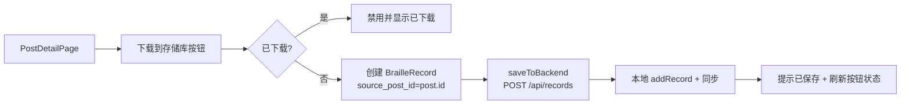

# 下载帖子到存储库

Feature Name: download-post-to-repository
Updated: 2026-08-14

## Description

用户可在展示区帖子详情页将他人分享的帖子数据(标题、来源类型、页数、文字内容)以一条新的 `BrailleRecord` 保存到自己的存储库,实现他人共享盲文内容的复用。同一帖子不允许重复下载,详情页会标记"已下载"。

## Architecture



### 关键决策

- **去重基于后端字段**:在 `BrailleRecord` 上新增 `source_post_id` 列,下载时记录来源帖子 ID。判断"已下载"时查询存储库中是否存在 `source_post_id == 当前帖子 id` 的记录。删除该记录后字段消失,自动允许再次下载,无需额外状态清理。
- **复用现有保存链路**:下载本质是一次 `createRecord`,复用 `home_provider` 中 `_saveRecord` 的"先写后端、再落本地"模式,保证 `syncFromBackend` 后记录不重复。

## Components and Interfaces

### 后端改动

| 文件 | 改动 |
|------|------|
| `backend/models.py` | `BrailleRecord` 新增 `source_post_id = Column(String(64), nullable=True)` |
| `backend/schemas.py` | `BrailleRecordCreate` 与 `BrailleRecordResponse` 新增 `source_post_id: Optional[str] = None` |
| `backend/api/routers/records.py` | `create_record` 保存 `req.source_post_id`;`list_records`/`get_record`/`rename_record` 返回该字段 |
| `backend/database.py` | `init_db` 后执行幂等迁移:若 `braille_records` 表缺少 `source_post_id` 列则 `ALTER TABLE ADD COLUMN`(兼容 MySQL/SQLite) |

迁移 SQL(幂等,由 `database.py` 自动执行):

```sql
ALTER TABLE braille_records ADD COLUMN source_post_id VARCHAR(64) DEFAULT NULL;
```

### 前端改动

| 文件 | 改动 |
|------|------|
| `book_scanner/lib/data/models/braille_record.dart` | `BrailleRecord` 新增可选 `sourcePostId` 字段,`toJson`/`fromJson`/`copyWith` 同步处理 |
| `book_scanner/lib/features/showcase/view/post_detail_page.dart` | 操作栏新增"下载到存储库"按钮;依据存储库中是否存在 `sourcePostId == post.id` 记录决定启用/禁用;点击后创建记录并调用保存链路 |

### 下载按钮交互

```dart
// 伪代码
final alreadyDownloaded = ref.watch(repoProvider).records
    .any((r) => r.sourcePostId == widget.postId);

_actionButton(
  theme,
  alreadyDownloaded ? Icons.download_done_rounded : Icons.download_rounded,
  alreadyDownloaded ? '已下载' : '下载到存储库',
  alreadyDownloaded,
  theme.colorScheme.primary,
  alreadyDownloaded ? null : () => _downloadToRepository(),
);
```

下载执行流程:

```dart
Future<void> _downloadToRepository() async {
  final post = state.post!;
  final record = BrailleRecord(
    id: DateTime.now().millisecondsSinceEpoch.toString(),
    title: post.title,
    sourceType: post.sourceType,
    dotMatrixWidth: 0,
    dotMatrixHeight: 0,
    dotMatrixData: [],
    textContent: post.textContent?.isNotEmpty == true ? post.textContent : null,
    pageCount: post.pageCount,
    createdAt: DateTime.now(),
    sourcePostId: post.id,
  );
  final serverId = await DatabaseHelper().saveToBackend(record);
  DatabaseHelper().addRecord(record.copyWith(id: serverId ?? record.id));
  ScaffoldMessenger.of(context).showSnackBar(...); // 已保存到存储库
}
```

## Data Models

`BrailleRecord` 新增字段:

| 字段 | 类型 | 说明 |
|------|------|------|
| `source_post_id` | String, 可空 | 来源帖子 ID;空表示本机生成的记录(扫描/打印/本地文件) |

`ShowcasePost` 无需改动,复用现有 `id`/`title`/`sourceType`/`pageCount`/`textContent`。

## Correctness Properties

- 下载成功前,按钮保持"下载中"状态,防止重复触发
- `saveToBackend` 失败时仅提示失败,不写入本地,不产生部分记录
- 同一帖子下载判定唯一依据为 `source_post_id` 精确匹配
- 本机扫描/打印生成的记录不携带 `source_post_id`,不受去重逻辑影响
- 删除已下载记录后,详情页按钮恢复为可下载状态

## Error Handling

| 场景 | 处理 |
|------|------|
| 后端不可达或创建失败 | SnackBar 提示"下载失败,请稍后重试",本地无残留 |
| 帖子加载中 | 下载按钮禁用 |
| 帖子不含文字内容 | 仍允许下载,记录 `textContent` 置空 |
| 重复点击 | 按钮禁用 `toggling` 式加载态,逻辑层二次拦截 `alreadyDownloaded` |

## Test Strategy

1. **后端**:启动后检查 `source_post_id` 列自动迁移;`POST /api/records` 携带 `source_post_id` 后 `GET /api/records` 能读回该字段
2. **前端(用户本地 flutter analyze/build)**:详情页对未下载帖子显示可下载按钮,点击后存储库列表出现新记录且字段正确;再次进入该帖子显示"已下载";删除记录后可再次下载
3. **回归**:本机扫描/打印生成的记录仍正常,`source_post_id` 为空

## References

^1: (File#L23) - `backend/models.py` BrailleRecord 模型
^2: (File#L42) - `backend/schemas.py` BrailleRecordCreate
^3: (File#L91) - `book_scanner/lib/data/local_db/database_helper.dart` saveToBackend
^4: (File#L70) - `book_scanner/lib/features/home/providers/home_provider.dart` _saveRecord
^5: (File#L159) - `book_scanner/lib/features/showcase/view/post_detail_page.dart` _interactionBar
